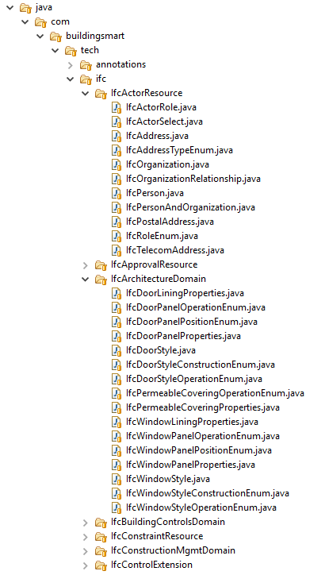
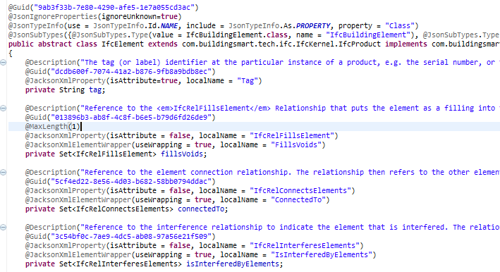

# IFC.JAVA

## What?
This repository contains all IFC entities in the form of a Java class library. It contains all the classes provided in the IFC EXPRESS schema, but in a JAVA syntax. Hence, these IFC classes can be used directly for working with IFC data in JAVA.

The code allows serialising and deserialising IFC objects to XML and JSON using out of the box annotations (Jackson package). IFC-SPF (STEP) is not supported. We suggest exporting building data in the right syntax directly from any BIM tool using scripts, native APIs, Dynamo scripts or other. Resulting JSON and XML can be loaded directly into this Java code library; and then the data can be used.

## Why?
IFC is a common data model in the AEC industry. Many starting developers and PhD students consider using IFC to obtain data. Yet, parsing IFC STEP files (.ifc) is cumbersome and difficult. With this library, XML and JSON versions of IFC data can be randomly read, used, and generated, thus easing the work for developers looking at IFC. These XML and JSON files are ideally equally interoperable with class libraries in C# and Python, which is work that is underway. 

## How?
The project is developed using maven, and the resulting artefact is meant to be published in the open maven repository (https://mvnrepository.com/) to allow re-use this library in other code.

This work is in progress. Code is likely unstable and not entirely user-friendely. Please report issues when you encounter them. Additional sample files are highly welcome as well; they are collected in the [Examples](examples/) folder. 

The code currently only contains the classes specified in IFC4 Addendum 2 (https://standards.buildingsmart.org/IFC/RELEASE/IFC4/ADD2/HTML/).

Serialisation and deserialisation is done using the Jackson package; and it is therefore out of the box. This code can be seen in the IO/IfcParser.java class. 

## Results
Sample data files (XML, JSON) can be found in the [Examples](examples/) folder. This includes:

- [simpleFile_IFC4.xml](examples/simpleFile_IFC4.xml): the input file used for testing purposes. This file was generated from Revit and IfcDoc, and then adapted so it can be deserialised in the Java class library.
- [serialized_randomhouse.xml](examples/serialized_randomhouse.xml): the same file, after deserialising and serialising using the IfcParser.java code.
- [serialized_randomhouse.xml](examples/serialized_randomhouse.json): the same file, in JSON syntax, after deserialisatin and serialising using the IfcParser.java code.
